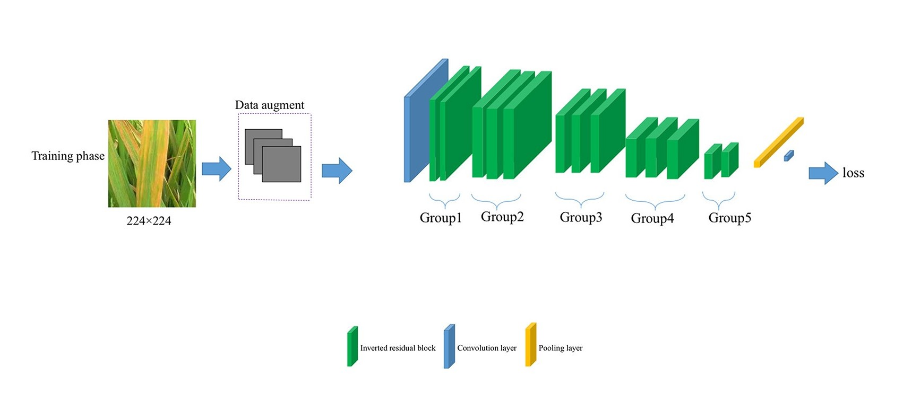
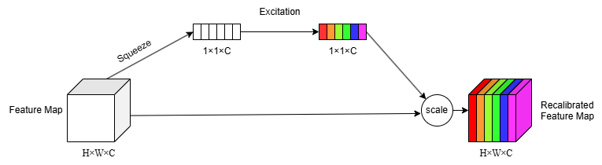

# LiSA-MobileNetV2
An improved MobileNetV2 model for rice disease classification by employing Lightweight structural optimization, Swish activation function, and Attention mechanism.

**"LiSA-MobileNetV2: An Enhanced Lightweight Model for Rice Disease Recognition and Deployment"** (submitted to *MDPI Agriculture*).
<p style="float: center">
  
  <div align="center">(A)</div>
</p>
<p style="float: center">
  
  <div align="center">(B)</div>
</p>

##  Repository Structure

- `model/`: Trained TFLite model and training details
- `scripts/`: Training, preprocessing, and evaluation scripts
- `requirements.txt`: Python dependencies


## Dataset

The dataset used in this project is the **Paddy Disease Classification** dataset available on Kaggle. You can download the dataset from the following link:

- [Paddy Disease Classification Dataset on Kaggle](https://www.kaggle.com/competitions/paddy-disease-classification)

The dataset includes 10 rice disease categories:

- bacterial_leaf_blight  
- bacterial_leaf_streak  
- bacterial_panicle_blight  
- blast  
- brown_spot  
- dead_heart  
- downy_mildew  
- hispa  
- normal  
- tungro  

Detailed description is in `data/README.md`.

##  Model: LiSA-MobileNetV2

LiSA-MobileNetV2 is an improved version of MobileNetV2 incorporating the following enhancements:

- Modified inverted residual structure
- Swish activation function
- SE (Squeeze-and-Excitation) attention module

The model achieves improved accuracy and lightweight performance, suitable for mobile deployment.

The final model is exported as a TensorFlow Lite file: `LiSA-MobileNetV2.tflite`.

##  Reproducibility

To reproduce the training process:

```bash
pip install -r requirements.txt
python scripts/train.py  

##  Contributors

This project was developed by:

- Yongqi Xu ([xuyongqi@stu.hunau.edu.cn](mailto:xuyongqi@stu.hunau.edu.cn)) - Implementing
- Zhijun Dai ([daizhijun@hunau.edu.cn](mailto:daizhijun@hunau.edu.cn)) - Supervisor

We welcome contributions from the community! Feel free to submit pull requests or raise issues.
